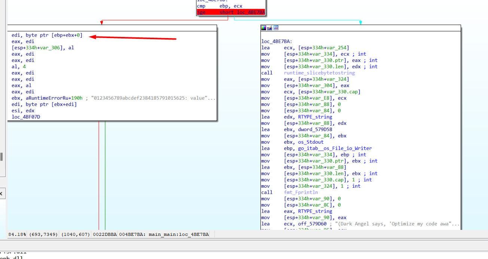
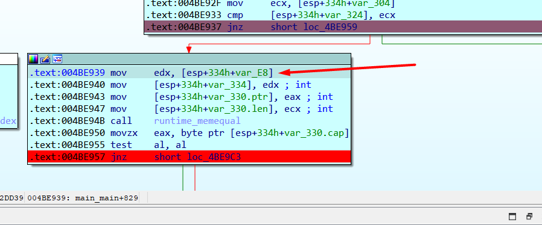
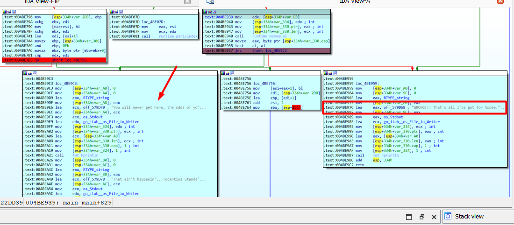
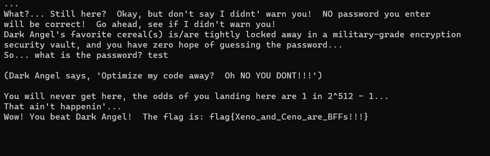
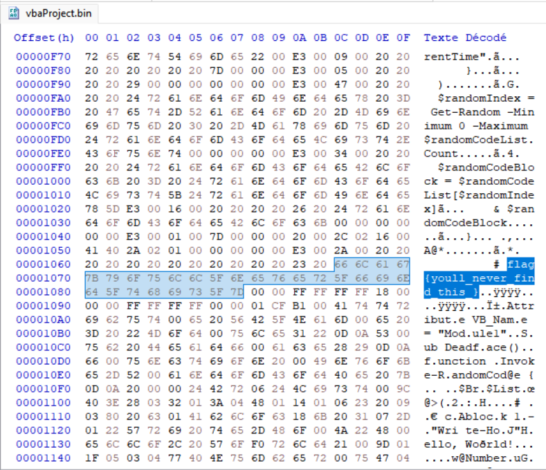
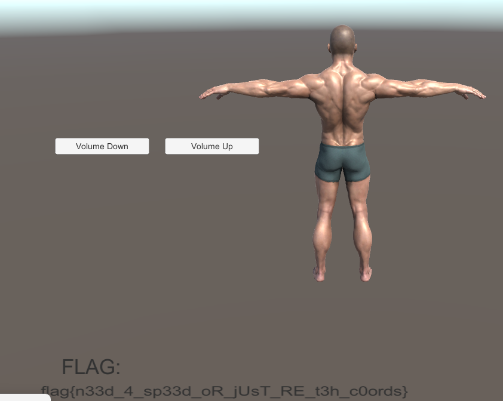

# Reverse Engineering 

## Cereal Killer 01

### Description

How well do you know your DEADFACE hackers? Test your trivia knowledge of our beloved friends at our favorite hactivist collective! We’ll start with bumpyhassan. Even though he grates on TheZeal0t a bit, we find him to be absolutely ADORKABLE!!!

Choose one of the binaries below to test your BH trivia knowlege.

### Solution

By opening the Binary in Ghidra, the interesting code is the following : 

```c
  local_108c = "I&_9a%mx_tRmE4D3DmYw_9fbo6rd_aFcRbE,D.D>Y[!]!\'!q";
  puts("Bumpyhassan loves Halloween, so naturally, he LOVES SPOOKY CEREALS!");
  puts("He also happens to be a fan of horror movies from the 1970\'s to the 1990\'s.");
  printf("What is bumpyhassan\'s favorite breakfast cereal? ");
  fgets(local_1014,0xfff,_stdin);
  local_1090 = local_1014;
  while ((*local_1090 != '\0' && (true))) {
    *local_1090 = *local_1090 + 7;
    local_1090 = local_1090 + 1;
  }
  *local_1090 = '\0';
  iVar1 = memcmp(&DAT_00012039,local_1014,0xe);
  if (iVar1 == 0) {
    puts("You are correct!");
    local_1088 = local_1078;
    for (; *local_108c != '\0'; local_108c = local_108c + 2) {
      *local_1088 = *local_108c;
      local_1088 = local_1088 + 1;
    }
    *local_1088 = '\0';
    printf("flag{%s}\n",local_1078);
  }
  else {
    puts("Sorry, that is not bumpyhassan\'s favorite cereal. :( ");
  }
```

One can notice that our input (local_1014) is compared to an encrypted buffer &DAT_00012039. The encryption is a simple Caesar cipher with a shift of 7. We can find the correct password as following by copying as a python list the content of &DAT_00012039 and substracting 7 to each element : 

```python
cipher_text = [ 0x4d, 0x79, 0x7c, 0x70, 0x7b, 0x80, 0x47, 0x52, 0x59, 0x5c, 0x4c, 0x4e, 0x4c, 0x59 ]
password = ""
for i in range(len(cipher_text)):
    flag += chr(cipher_text[i] - 7)
print(password)
```

## Cereal Killer 02

### Description

luciafer can be a bit of trouble sometimes, but she can put away the sugary monster cereals with the best of them! She has a favorite, too, and it is based on her favorite monster. See if you can figure it out! Select the binary for your preferred platform.

### Solution

Once again, by opening the binary in Ghidra, we find the part where our input is processes : 

```c
  puts("Luciafer also loves Halloween, so she, too, LOVES SPOOKY CEREALS!");
  puts("She has different favorite villain from 70-80\'s horror movies.");
  printf("What is Luciafer\'s favorite breakfast cereal? ");
  fgets(input,0xfff,_stdin);
  decode_str(input,63,&encrypted_buffer,output_buffer);
  iVar1 = strncmp(output_buffer,"CORRECT!!!!!",0xc);
  if (iVar1 == 0) {
    puts(output_buffer);
  }
  else {
    printf("%s",
           "INCORRECT....: I\'m afraid that is not Lucia\'s current favorite monster cereal.  She is  kind of capricious, you know, so it changes often.\n"
          );
  }
```

I already renamed some variables to make the code more readable. By looking at the decode_str function, one can notice that it's a simple xor between our input and the encrypted buffer. As the output is then compared to "CORRECT!!!!!", we can simply xor the encrypted buffer with "CORRECT!!!!!" to find the password : 

```python
Encrypted_Buffer = [ 0x08, 0x3d, 0x33, 0x3f, 0x15, 0x36, 0x32, 0x47, 0x52, 0x12, 0x1b, 0x65, 0x6b, 0x48, 0x41, 0x0b, 0x3c, 0x14, 0x01, 0x1d, 0x34, 0x41, 0x5b, 0x29, 0x1b, 0x13, 0x4c, 0x26, 0x02, 0x34, 0x2b, 0x16, 0x06, 0x40, 0x17, 0x0d, 0x38, 0x5f, 0x22, 0x02, 0x3d, 0x1c, 0x08, 0x4b, 0x35, 0x5c, 0x48, 0x69, 0x0f, 0x13, 0x4c, 0x2f, 0x31, 0x11, 0x4b, 0x2d, 0x1a, 0x57, 0x49, 0x65, 0x6a, 0x53, 0x1c, 0x00 ]
Known_plaintext = "CORRECT!!!!!"
Decrypted_Buffer = []
for i in range(len(Encrypted_Buffer)):
    Decrypted_Buffer.append(chr(Encrypted_Buffer[i] ^ ord(Known_plaintext[i % len(Known_plaintext)])))
print("".join(Decrypted_Buffer))
```

## Cereal Killer 04

### Description

lilith is not too old to have a favorite monster / ghoul / daemon / phantasm / poltergeist / creature / extraterrestrial or a favorite sugary breakfast cereal! She also has a favorite programming language (which no one else at DEADFACE likes that much, and they all think she is kinda weird for it). She probably mainly likes it because it was her first language she learned at the age of 9.

See if you can crack her program and figure out what her favorite cereal and entity are.

### Solution 

For this challenge, we're provided a jar file. We can thus open it in Jadx. The jar contains an implementation of base85 and this main code : 

```java
public static void main(String[] args) {
        byte[] kitbal = "b7&q76n=gW3>RT?YXJcPb7*05YXJcPb7*05YXN?K3}_w=6n=hw3>RT?YXJcPb7*056n+5#b7*05YXN?K3}#_+YXJcPb7*05YXJcPb7*f36n+5#b7*05YXJd%3>O{^6n=hweHR{bYXJcPb7*05YXJcPb7*05YkqzKb7*05Ykq!y3>RT?YXJcPb7*05YXJcPb7)}=6afJb3>RT?YXJcP3>O}9Yb$;Za~B>B6ny~!FK8YO6n=gIb7*056n=hwb7*0GYYqVc4;LN{6n+5#4`^X>6n=hw3}<0-H+}&D3>O{^7k&X<3>RT?Ykq!y3>O{^6n=hwFKA(MHvxWr3>O{^WB~yI3>O{^6b@Yhb2J_eYkq!y3>RSy6n=hw3>Q6eYh3|;3}|k0YXJcP4`^X>6n=hwb7)}=6n=hwd}v`V6kP!UFBcwiYXJd$a};4%7XbkQ3>O_PYXMyW4;LPCYkdI$b7x@<6n=dHa};3?YXJccb7)~MYXJd$3};~t6n=dHb7&q77Y+dd3}_uLYkqzK4;OB76n+7H3}|5u6ajq!b7(z%YXN?K3}+n;6n=hwb7&oMHvs`%b7&n76n+5#4-_79YkqzK4`^X7WC0Eib7&oMWB~zvb7x_46ajq!d}v{EYkdI$a~B>CYXMyWa};56YYqVpb3$P*YXMyWb2MRcH-3H&a~B?R7k&-_d>3wVYaam}b97;HWB~yIb2MRcYXN-$a}*v86kP!UFKB6UYaM<cb75f)6nz1Gb7&q76b@Yhb2MQNWB~yIFBBdP6ajq!d}v{EYXJcPa}+&tYXNuxa};iJ6n+7HFKA&dYkdv@b7*01WB~yIa}i;3YXJ!Xb95eTYX|`Wb2MRc7XblXb2MRcYj^<x4`^X*YaanCb2J_eHvs`%3>O{^V}5>q3}|6}7k++zb7*dIYYqVpb7&n66n=hw3>RT?WPN^q3}|6&6n<R+a}*v86n+j}3>O}9YYu&W3>RT?b$)(bb7(yc6n+kV3>O}9Yaf1o3>O{^6afJaFBcvSHvs_&3>O{^YXJ^^3^ZYKH-3Iy3}_t<6n=hP3>RT?WPN^q3>R)L6n=hPb7*c26kP#b3>O|QYXJ@ca};3?YbyZ(b7*05YXJcPb7*05YXJd$d}kgF6n=gVb7)}>6n%aHb7*05YXJcP4`*R=YXJd$d}v{EYXJcPb7*05YXJcPa};iJYXJcP4`*R=YXJcPb7*05YXJcPa};iJYXJcPb7)}>WB~yIb7)}>WB~yIb7&oXYXJcPb7*05YXJd$d}v{EYXJcP4`*R=YXJcPb7*05YXN-@b7*05YXJcPb7&oXYXN=^3};~".getBytes();
        byte[] amhoamho = "DEADFACE".getBytes();
        byte[] amho = "7yZuW4pATQ".getBytes();
        Scanner scanner = new Scanner(System.in);
        System.out.println("lilith's favorite cereal is also her favorite monster / ghoul / daemon / phantasm / poltergeist / creature / extraterrestrial.");
        System.out.print("To get both answers (and the flag), enter her entity (with special characters) as a password: ");
        String sayongchaAmho = scanner.nextLine().trim();
        Base85.Z85Decoder zdecoder = new Base85.Z85Decoder();
        Base85.Rfc1924Decoder decoder = new Base85.Rfc1924Decoder();
        byte[] amhoDec = zdecoder.decode(amho);
        for (int j = 0; j < amhoDec.length; j++) {
            int jdx = j % amhoamho.length;
            int i = j;
            amhoDec[i] = (byte) (amhoDec[i] ^ amhoamho[jdx]);
        }
        String amhoDecStr = new String(amhoDec, StandardCharsets.UTF_8);
        if (!amhoDecStr.equals(sayongchaAmho)) {
            System.out.println("Sorry, that is not the correct monster / cereal / password.  Please try again.");
            System.exit(0);
        }
        byte[] kitbalDec = decoder.decode(kitbal);
        for (int i2 = 0; i2 < kitbalDec.length; i2++) {
            int idx = i2 % amhoDec.length;
            int i3 = i2;
            kitbalDec[i3] = (byte) (kitbalDec[i3] ^ amhoDec[idx]);
        }
        String kitbalStr = new String(kitbalDec, StandardCharsets.UTF_8);
        System.out.println("If anyone has wisdom, let him / her decompile the Java code and crack the encrypted cereal!");
        System.out.println("Congratulations, Oh Wise One!");
        System.out.println("");
        System.out.println(kitbalStr);
    }
```

We see that the flag is contained in the variable kitbal so let's analyze how this one is decrypted. To obtain kitbalDec, we saw a xor between kitbalDec and amhoDec. amhoDec is obtained by a xor between amhoDec and amhoamho. amhoamho is a simple string (DEADFACE) and amhoDec is a base85 encrypted string in the mode Rfc1924. We can use cyberchef to decrypt this first part. Here's the receipe I used : https://gchq.github.io/CyberChef/#recipe=From_Base85('0-9a-zA-Z.%5C%5C-:%2B%3D%5E!/*?%26%3C%3E()%5B%5D%7B%7D@%25$%23',false,'')XOR(%7B'option':'UTF8','string':'DEADFACE'%7D,'Standard',false)&input=N3ladVc0cEFUUQ . Using that, we can now obtain the flag using the same principle but mode Z85 instead of Rfc1924 : https://gchq.github.io/CyberChef/#recipe=From_Base85('0-9A-Za-z!%23$%25%26()*%2B%5C%5C-;%3C%3D%3E?@%5E_%60%7B%7C%7D~',false,'')XOR(%7B'option':'UTF8','string':'SHARK!!!'%7D,'Standard',false)&input=YjcmcTc2bj1nVzM%2BUlQ/WVhKY1BiNyowNVlYSmNQYjcqMDVZWE4/SzN9X3c9Nm49aHczPlJUP1lYSmNQYjcqMDU2bis1I2I3KjA1WVhOP0szfSNfK1lYSmNQYjcqMDVZWEpjUGI3KmYzNm4rNSNiNyowNVlYSmQlMz5Pe142bj1od2VIUntiWVhKY1BiNyowNVlYSmNQYjcqMDVZa3F6S2I3KjA1WWtxIXkzPlJUP1lYSmNQYjcqMDVZWEpjUGI3KX09NmFmSmIzPlJUP1lYSmNQMz5PfTlZYiQ7WmF%2BQj5CNm55fiFGSzhZTzZuPWdJYjcqMDU2bj1od2I3KjBHWVlxVmM0O0xOezZuKzUjNGBeWD42bj1odzN9PDAtSCt9JkQzPk97XjdrJlg8Mz5SVD9Za3EheTM%2BT3teNm49aHdGS0EoTUh2eFdyMz5Pe15XQn55STM%2BT3teNmJAWWhiMkpfZVlrcSF5Mz5SU3k2bj1odzM%2BUTZlWWgzfDszfXxrMFlYSmNQNGBeWD42bj1od2I3KX09Nm49aHdkfXZgVjZrUCFVRkJjd2lZWEpkJGF9OzQlN1hia1EzPk9fUFlYTXlXNDtMUENZa2RJJGI3eEA8Nm49ZEhhfTszP1lYSmNjYjcpfk1ZWEpkJDN9O350Nm49ZEhiNyZxNzdZK2RkM31fdUxZa3F6SzQ7T0I3Nm4rN0gzfXw1dTZhanEhYjcoeiVZWE4/SzN9K247Nm49aHdiNyZvTUh2c2AlYjcmbjc2bis1IzQtXzc5WWtxeks0YF5YN1dDMEVpYjcmb01XQn56dmI3eF80NmFqcSFkfXZ7RVlrZEkkYX5CPkNZWE15V2F9OzU2WVlxVnBiMyRQKllYTXlXYjJNUmNILTNIJmF%2BQj9SN2smLV9kPjN3VllhYW19Yjk3O0hXQn55SWIyTVJjWVhOLSRhfSp2ODZrUCFVRktCNlVZYU08Y2I3NWYpNm56MUdiNyZxNzZiQFloYjJNUU5XQn55SUZCQmRQNmFqcSFkfXZ7RVlYSmNQYX0rJnRZWE51eGF9O2lKNm4rN0hGS0EmZFlrZHZAYjcqMDFXQn55SWF9aTszWVhKIVhiOTVlVFlYfGBXYjJNUmM3WGJsWGIyTVJjWWpePHg0YF5YKllhYW5DYjJKX2VIdnNgJTM%2BT3teVn01PnEzfXw2fTdrKyt6YjcqZElZWXFWcGI3Jm42Nm49aHczPlJUP1dQTl5xM318NiY2bjxSK2F9KnY4Nm4ran0zPk99OVlZdSZXMz5SVD9iJCkoYmI3KHljNm4ra1YzPk99OVlhZjFvMz5Pe142YWZKYUZCY3ZTSHZzXyYzPk97XllYSl5eM15aWUtILTNJeTN9X3Q8Nm49aFAzPlJUP1dQTl5xMz5SKUw2bj1oUGI3KmMyNmtQI2IzPk98UVlYSkBjYX07Mz9ZYnlaKGI3KjA1WVhKY1BiNyowNVlYSmQkZH1rZ0Y2bj1nVmI3KX0%2BNm4lYUhiNyowNVlYSmNQNGAqUj1ZWEpkJGR9dntFWVhKY1BiNyowNVlYSmNQYX07aUpZWEpjUDRgKlI9WVhKY1BiNyowNVlYSmNQYX07aUpZWEpjUGI3KX0%2BV0J%2BeUliNyl9PldCfnlJYjcmb1hZWEpjUGI3KjA1WVhKZCRkfXZ7RVlYSmNQNGAqUj1ZWEpjUGI3KjA1WVhOLUBiNyowNVlYSmNQYjcmb1hZWE49XjN9O34

This output an ASCII text which contain the flag

## Cereal Killer 05

### Description

We think Dr. Geschichter of Lytton Labs likes to use his favorite monster cereal as a password for ALL of his accounts! See if you can figure out what it is, and keep it handy! Choose one of the binaries to work with.

### Solution 

Opening the file in Ghidra gives this code : 

```c
  for (local_254 = 0; local_254 < 0x21; local_254 = local_254 + 1) {
    if ((&DAT_00012008)[local_254] != '\0') {
      local_235[local_254] = (&DAT_00012008)[local_254] ^ "Xen0M0rphMell0wz"[local_254 % 0x10];
    }
  }
  local_235[32] = 0;
  FUN_000110e0(
              "Dr. Geschichter, just because he is evil, doesn\'t mean he doesn\'t have a favorite c ereal."
              );
  FUN_000110c0(&DAT_0001211c,
               "Please enter the passphrase, which is based off his favorite cereal and entity: " );
  FUN_00011100(&DAT_0001211c,local_214);
  iVar1 = FUN_000110b0(local_214,"Xen0M0rphMell0wz");
  if (iVar1 == 0) {
    FUN_000110e0(local_235);
  }
  else {
    FUN_000110e0("notf1aq{you-guessed-it---this-is-not-the-f1aq}");
  }
```

One can clearly notice the string Xen0M0rphMell0wz. Input this and you'll obtain the flag. This challenge, which is really easy, was in fact a hint for another challenge. In the description, we can read than Dr. Geschichter uses this password everywhere. Unfortunately, I didn't notice this during the CTF. 


## Cereal Killer 06

### Description 

Dark Angel has a favorite cereal, but don’t expect him to tell you what it is! He is a mercenary hacker that contracts to Lytton Labs, so he is extremely paranoid about protecting all of his personal information, even his favorite cereal! He treats it like a closely guarded government secret!

Choose the Windows or Linux binary to see if you can defeat Dark Angel and get access to his deep, dark secret cereal!

### Solution 

This challenge may seem complicated at first as the binary was written in go. For Go challenges I use IDA instead of ghidra. I also used the Windows binary for this challenge. When running it, we can read this : 

```
Dark Angel is not only a mercenary hacker with no scruples or compassion.  He is also
quite a disagreeable fellow who always believes he is right and you are wrong.
So, before you get into an argument with him about which monster cereal is best,
I highly suggest you just not JUMP to any conclusions.  Just walk away from this
challenge, because there is no solution.  You can't win an argument with a
black-hat hacker who engages in sophistry.
...
What?... Still here?  Okay, but don't say I didnt' warn you!  NO password you enter
will be correct!  Go ahead, see if I didn't warn you!
Dark Angel's favorite cereal(s) is/are tightly locked away in a military-grade encryption
security vault, and you have zero hope of guessing the password...
So... what is the password?
```

This gives us a big hint : "JUMP". I decided to solve this challenge dynamically by changing the control flow of the binary. First, let's look at the main function. If we scroll to the very bottom of the code, one can see this : 

```c
    fmt_Fprintf(
      (int)&go_itab__os_File_io_Writer,
      os_Stdout,
      (int)"Wow! You beat Dark Angel!  The flag is: %s\n",
      43,
      (int)&v47,
      1,
      1);
    (*v71)();
  }
  else
  {
    v51[0] = &RTYPE_string;
    v51[1] = &off_6E9D68;
     fmt_Fprintln((int)&go_itab__os_File_io_Writer, os_Stdout, (int)v51, 1, 1);
  }
```

So we found the part where the flag is printed. We can see it's part of a big if so let's go to the top to see what is the content of this if : 

```c
 if ( v18.ptr == v21 && runtime_memequal(v35, SHIDWORD(v17), (int)v21) )
```

I then decided to look at the graph of the function. Thanks to the lots of print in the binary, it was easy to notice we I first had to put a breakpoint. Here, we can see a text which was not printed, so I decided to break just before and changed IP to the right branch (you can do this during debugging by using right click on the instruction you want to set as next one)



Then, I put a breakpoint to the next conditional jump. On the right branch, the text "WRONG!!! That's all I've got for todee." is printed so I set the IP to the left branch : 



I did the same analysis for the third branch : 



Finally, we come in the branch with the text "You will never get here, ...." printed. This branch is the part where the flag is printed so I put a final breakpoint after the flag is printed so that the program doesn't exit. 



## My Daily Macros

### Description

DEADFACE has gotten hold of the HR departments contact list and has been distributing it with a macro in it. There is a phrase the RE team would like for you to pull out of the macro.

### Solution 

This challenge provide an excel document. One has to know that excels documents are in fact archive which can be opened using winrar. As the descriptions talks about macros, I opened the document in winrar and found a file called vbaProject.bin. This file contains the macro. I first looked at the hex code of the file and found the flag : 



## Gamertime: Cheat Code

### Description

DEADFACE has created a game to help recruit new young members. Apparently there is a flag hidden in the binary that can only be accessed by entering a cheatcode that is used as a secret password before they allow these new recruits to join their ranks.

### Solution 

This challenge provide a Unity Game. The description tells us that a find is hidden in the binary if we enter a cheat code. To get the source code of the game, I used dnSpy and loaded the Assembly-CSharp.dll file (you can find it in the directory windows_gamertime2\3DPlatformer_Data\Managed). In the decompiler, one can find a class called CheatCode, which contains this code 

```c#
private void Update()
	{
		if (Input.anyKeyDown)
		{
			if (Input.GetKeyDown(this.cheatCode[this.index]))
			{
				this.index++;
			}
			else
			{
				this.index = 0;
			}
		}
		if (this.index == this.cheatCode.Length)
		{
			this.flagText.text = "flag{d00m_guY_off_Th3_ch3@ts}";
			this.index = 0;
		}
	}
```

## STARvin for Secrets 1: Lindsey's Lyrics

### Description 

Svetlana, an employee of Aurora Pharmaceuticals, navigated to Lindsey's Lyrics to download a program to enable her to convert Youtube videos to MP3 files. She was prompted to download MusicDownloader.exe and she did. The local network defenders got a notification that a sketchy file got downloaded so are investigating, They have called you in as their malware analysis expert. RE the executable and find the flags!

### Solution 

When looking at the main functions, we see that several functions are called : 

1) oreos create some entries in the Registry
2) milk create a new utilisateur and add it to the Administrators group
3) wishbone looks at every file in your computer containing the world "star" on it. It then calls golden_retriever which will put these files in a zip archive called Exfil.zip
4) ykk compresses the whole folder with the files containing star
5) cryptkeeper will create a directory key with an encryption key
6) Enigma xor the zip with the encryption key
7) exfil will finally establish a connection and send the zip archive through icmp packets of 32 bytes. 

For the first part of this challenge, the registry key "ZmxhZ3sxbnMxZGV" seems suspicious. Then, the password of the user created also look suspicious : "fdDNoX21AdHIxeH0=". Concatening these 2 strings and decoding it as base64 will give the flag. 

# PWN

## Gamertime: Need for Speed

### Description

DEADFACE has created a game to help recruit new young members. Apparently there is a flag returned by a game server when you reach the flag at the end of the level. This is used to see which new, young recruits are true gamers. Can you find the flag?

### Solution 

We're back with the Unity Game. This time, we must reach the end of the game. If we look again at the c# code, we can find the character movement function : 

```c#
private void Update()
	{
		this.moveDirection = new Vector3(Input.GetAxis("Horizontal") * this.moveSpeed, this.moveDirection.y, Input.GetAxis("Horizontal") * this.moveSpeed);
		if (Input.GetButtonDown("Jump") && this.guy.isGrounded)
		{
			this.moveDirection.y = this.jumpForce;
		}
		this.moveDirection.y = this.moveDirection.y + Physics.gravity.y * this.gravityScale * Time.deltaTime;
		this.guy.Move(this.moveDirection * Time.deltaTime);
	}
```

I decided to modify this function to reach the end of the game quickly. I changed the code like this : 

```c#
private void Update()
	{
		this.moveDirection = new Vector3(Input.GetAxis("Horizontal") * this.moveSpeed, this.moveDirection.y, 80f);
		if (Input.GetButtonDown("Jump") && this.guy.isGrounded)
		{
			this.moveDirection.y = this.jumpForce;
		}
		this.moveDirection.y = this.moveDirection.y + Physics.gravity.y * this.gravityScale * Time.deltaTime;
		this.guy.Move(this.moveDirection * Time.deltaTime);
	}
```


Afterwards, I just played the game and reached the end easily : 



# Programming

## Chatty Cathy

### Description 

That Python dead drop program put Aurora Pharmaceuticals' IT team on high alert; they looked closer at notifications in their Security Operation Center (SOC) and identified even more malware deep in the network! They retrieved a compiled binary along with some rough code from yet another infected user workstation. It appears to be some sort of Command and Control server, but requires a password to be accessed. Intel indicates that the full flag from Dead Drop may work as the password.. Dig into this program and see what secrets it holds.

### Solution 

This challenge provides a binary and a the (partial) c code of the binary. The solution I used is probably unintended but I simple reversed the function which prints the flag. I found it by comparing the c code and the assembly code. Here's the function : 

```c
void FUN_0040194a(void)

{
  undefined8 local_38;
  undefined8 local_30;
  undefined8 local_28;
  undefined6 local_20;
  undefined2 uStack_1a;
  undefined6 uStack_18;
  int local_10;
  int local_c;
  
  local_38 = 0x9b9f92819d9b969c;
  local_30 = 0x89da9e949bda898a;
  local_28 = 0x949bda8991999b8e;
  local_20 = 0x899d8f98da9e;
  uStack_1a = 0x95da;
  uStack_18 = 0x87db8397da92;
  local_10 = 38;
  for (local_c = 0; local_c < local_10; local_c = local_c + 1) {
    FUN_00419730(*(byte *)((long)&local_38 + (long)local_c) ^ 0xfa);
  }
  FUN_00419730(10);
  return;
}
```

I modified the type of local_38 to be a char[38] (using right click -> retype variable) and then copied the array. I xored this array with 0xfa, applied and operator to go back to positive value and then converted it to ASCII to obtain the flag. 

```python 
encrypted_byte = [-100, -0x6a, -0x65, -99, -0x7f, -0x6e, -0x61, -0x65, -0x76, -0x77, -0x26, -0x65, -0x6c, -0x62, -0x26, -0x77, -0x72, -0x65, -0x67, -0x6f, -0x77, -0x26, -0x65, -0x6c, -0x62, -0x26, -0x68, -0x71, -99, -0x77, -0x26, -0x6b, -0x6e, -0x26, -0x69, -0x7d, -0x25, -0x79]
decrypted_byte = ""
for i in range(len(encrypted_byte)):
    decrypted  = (encrypted_byte[i] ^ 0xfa) & 0xff
    decrypted_byte += chr(decrypted)
print(decrypted_byte)
```

