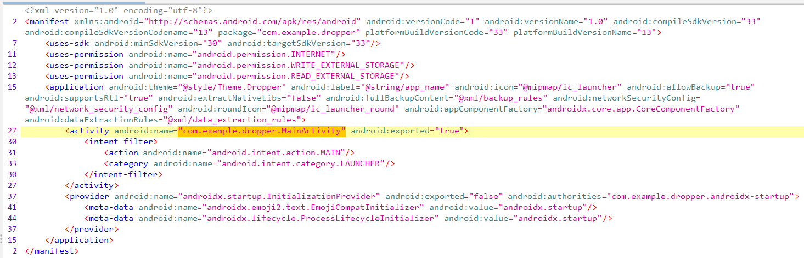
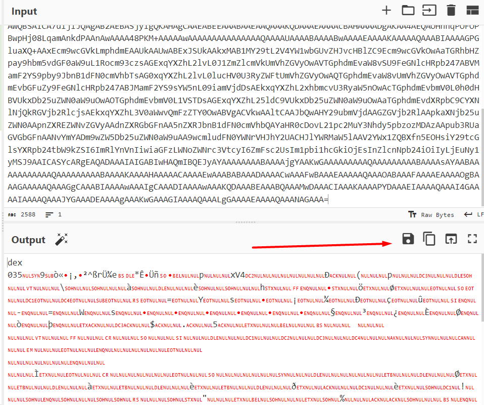

This challenge is an easy android reversing challenge. The provided file is an apk so let's open it in a decompiler such as JadX (https://github.com/skylot/jadx). We can see a lot of classes so to find the main function, let's look at the AndroidManifest.xml (in the Ressources)



Here, the main function is in "com.example.dropper.MainActivity". By looking at the source code, we see it's decoding a dex file and then loading it. Let's thus copy the base64 strings and decode the dex file. We can use CyberChef for that (https://gchq.github.io/CyberChef/)



We can now open the dex file in JadX : 

```Java
static byte[] notTheFlag;

    public static String getFlag() throws IOException {
        String str;
        HttpURLConnection httpURLConnection = (HttpURLConnection) new URL("http://misc.csaw.io:3003").openConnection();
        try {
            try {
                httpURLConnection.connect();
                str = new BufferedReader(new InputStreamReader(httpURLConnection.getInputStream())).readLine();
            } catch (Exception e) {
                e.printStackTrace();
                httpURLConnection.disconnect();
                str = "";
            }
            notTheFlag = Base64.getDecoder().decode(str);
            return obf(275, 306, 42);
        } finally {
            httpURLConnection.disconnect();
        }
    }

    public static String obf(int i, int i2, int i3) {
        int i4 = i2 - i;
        char[] cArr = new char[i4];
        for (int i5 = 0; i5 < i4; i5++) {
            cArr[i5] = (char) (notTheFlag[i + i5] ^ i3);
        }
        return new String(cArr);
    }
```

We see it's basically opening a connection to http://misc.csaw.io:3003 and then applying a deobfuscation function. When we open the url, we find this string : bEVYCkNEWV5LRElPBgpFRApeQk8KWkZLRE9eCm9LWF5CBgpHS0QKQktOCktGXUtTWQpLWVlfR09OCl5CS14KQk8KXUtZCkdFWE8KQ0ReT0ZGQ01PRF4KXkJLRApORUZaQkNEWQpIT0lLX1lPCkJPCkJLTgpLSUJDT1xPTgpZRQpHX0lCCgcKXkJPCl1CT09GBgpkT10Kc0VYQQYKXUtYWQpLRE4KWUUKRUQKBwpdQkNGWV4KS0ZGCl5CTwpORUZaQkNEWQpCS04KT1xPWApORURPCl1LWQpHX0lBCktIRV9eCkNECl5CTwpdS15PWApCS1xDRE0KSwpNRUVOCl5DR08ECmhfXgpJRURcT1hZT0ZTBgpJWUtdSV5MUU5TRB5HG0l1RkUeTk94WXVYdUxfZAtXXkJPCk5FRlpCQ0RZCkJLTgpLRl1LU1kKSE9GQ09cT04KXkJLXgpeQk9TCl1PWE8KTEtYCkdFWE8KQ0ReT0ZGQ01PRF4KXkJLRApHS0QKBwpMRVgKWlhPSUNZT0ZTCl5CTwpZS0dPClhPS1lFRFkE

We can suppose this is the obfuscated flag so we have to reverse the obf function, which is a simple xor : 

```Python
def reverse_obf(i, i2, i3):
    notTheFlag = base64.b64decode("bEVYCkNEWV5LRElPBgpFRApeQk8KWkZLRE9eCm9LWF5CBgpHS0QKQktOCktGXUtTWQpLWVlfR09OCl5CS14KQk8KXUtZCkdFWE8KQ0ReT0ZGQ01PRF4KXkJLRApORUZaQkNEWQpIT0lLX1lPCkJPCkJLTgpLSUJDT1xPTgpZRQpHX0lCCgcKXkJPCl1CT09GBgpkT10Kc0VYQQYKXUtYWQpLRE4KWUUKRUQKBwpdQkNGWV4KS0ZGCl5CTwpORUZaQkNEWQpCS04KT1xPWApORURPCl1LWQpHX0lBCktIRV9eCkNECl5CTwpdS15PWApCS1xDRE0KSwpNRUVOCl5DR08ECmhfXgpJRURcT1hZT0ZTBgpJWUtdSV5MUU5TRB5HG0l1RkUeTk94WXVYdUxfZAtXXkJPCk5FRlpCQ0RZCkJLTgpLRl1LU1kKSE9GQ09cT04KXkJLXgpeQk9TCl1PWE8KTEtYCkdFWE8KQ0ReT0ZGQ01PRF4KXkJLRApHS0QKBwpMRVgKWlhPSUNZT0ZTCl5CTwpZS0dPClhPS1lFRFkE")  
    encrypted_data = notTheFlag[i:i2] 
    decrypted_data = [byte ^ i3 for byte in encrypted_data] 
    return ''.join(map(chr, decrypted_data))  

i = 275
i2 = 306
i3 = 42
result = reverse_obf(i, i2, i3)
print(result)
```

When running this code, we get the flag ! 


