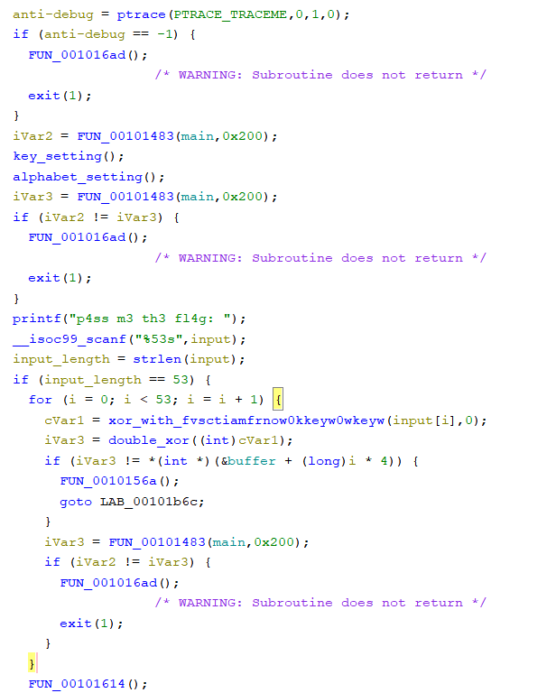

This challenge was part of the vsCTF2023 and provides an elf file. By opening in it in Ghidra and looking at the main function, here's what we can see:



The first thing I noticed is the called to ptrace(PTRACE_TRACEME,0,1,0); which is a known anti-debugging technique. This is however easily bypassed (patching instructions, hooking the function, ...). Then, a bit further, the flag checking routine is present. We first notice that the flag should be 53 char length. Then we see 2 calls to function and then a if. One can clearly assume that the 2 calls are used to encrypt the given input. So by going backward, we'll probably get the flag. The first method (which I called doublexor) is simply xoring the given char with 0x12. The second method is slightly more complex but is a recursive xor : 

```c
char xor_with_fvsctiamfrnow0kkeyw0wkeyw(char input_char,int zero)
{
  if (zero < 4) {
    input_char = xor_with_fvsctiamfrnow0kkeyw0wkeyw
                           (input_char ^ (&secret)[(long)zero * 11],zero + 1);
  }
  return input_char;
}
```

One can note that the decompiled code is much more readable when the variables have been retyped correctly ! We almost have all needed pieces to reverse the algorithm. We just need the value of secret. By right click -> show reference, we can find the method where this secret buffer is filled : 

```c

void key_setting(void)
{
  strcpy(&secret,s3cR);
  strcat(&secret,3ts3);
  strcpy(&secret2,vsct);
  strcat(&secret2,fvsctiamfrnow0kkeyw0wkeyw);
  strcpy(&secret3,fvsctiamfrnow0kkeyw0wkeyw + 5);
  strcat(&secret3,fvsctiamfrnow0kkeyw0wkeyw + 10);
  strcpy(&secret4,fvsctiamfrnow0kkeyw0wkeyw + 15);
  strcat(&secret4,fvsctiamfrnow0kkeyw0wkeyw + 20);
  return;
}
```

You see here multiple copy and then concat. Pay attention here that the buffer are all 10 bytes longs. I didn't notice that at first and it took me a while to understand why the flag was not correct.

The last thing we need is the encrypted flag. One again, by going back in the main method at the buffer and looking for reference, we can find it : 

```c
if (iVar3 != *(int *)(&buffer + (long)i * 4))
```

```c	
void buffef_filling(void)

{
  int i;
  int j;
  
  for (i = 0; i < 26; i = i + 1) {
    *(int *)(&buffer + (long)i * 4) = (int)(char)(&encryptedflag1)[i];
  }
  for (j = 0; j < 27; j = j + 1) {
    *(int *)(&buffer + (long)(j + 26) * 4) = (int)(char)(&encryptedflag2)[j];
  }
  return;
}
```

Now we have all pieces in order to reverse the algorithm. Here's the python script I used : 

```python
encrypted_flag = [0x7e, 0x7b, 0x6b, 0x7c, 0x6e, 0x73, 0x7f, 0x3b, 0x3c, 0x63, 0x57, 0x3c, 0x66, 0x7c, 0x39, 0x57, 0x6c, 0x3b, 0x6a, 0x7d, 0x6f, 0x6f, 0x3b, 0x7a, 0x7b, 0x57, 0x3c, 0x7a, 0x3b, 0x57, 0x66, 0x38, 0x57, 0x65, 0x3c, 0x7c, 0x6b, 0x60, 0x57, 0x6e, 0x38, 0x7a, 0x57, 0x7c, 0x60, 0x3b, 0x57, 0x3b, 0x39, 0x3b, 0x3b, 0x3f, 0x75 ]
xor_key1 = 0x12

secret1 = b"s3cR3ts3\x00\x00" #10 bytes long !
secret2 = b"vsctfvscti" #also 10 bytes long !
secret3 = b"iamfrnow0k" #same here
secret4 = b"keyw0wkeywwkeyw" #same here

secret = secret1 + secret2 + secret3 + secret4

#xoring alpba et with the first key 
decrypted_flag1 = [encrypted_flag[i] ^ xor_key1 for i in range(len(encrypted_flag))]

#applying recursive xor
def xor_with_fvsctiamfrnow0kkeyw0wkeyw(param_1, zero):
    if zero < 4:
        param_1 = xor_with_fvsctiamfrnow0kkeyw0wkeyw(param_1 ^ secret[zero * 11], zero + 1)
    return param_1

flag = ""
for i in range(len(decrypted_flag1)):
    flag += chr(xor_with_fvsctiamfrnow0kkeyw0wkeyw(decrypted_flag1[i],0))

print("".join(flag))
```


