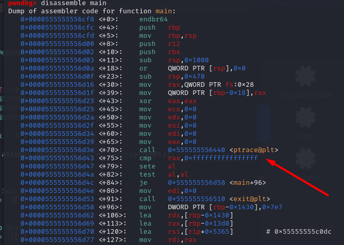
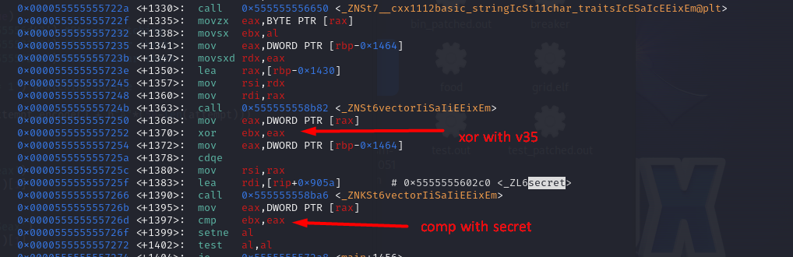

This challenge was part of the VSCTF23. We're provided a binary file. I first tried to open the file in Ghidra but I was prompted with this error : 
```
Low-level Error: Unable to resolve type: Modular
```
Anyway, I tried to opened the file in IDA and it worked ! When dealing with that kind of challenge, it's always a good start to find the success or error message. The first thing I found is this : 

```c
  std::__cxx11::basic_string<char,std::char_traits<char>,std::allocator<char>>::basic_string(input);
  std::operator<<<std::char_traits<char>>(&std::cout, "Enter your flag: ");
  std::operator>><char,std::char_traits<char>,std::allocator<char>>(&std::cin, input);
  if ( std::__cxx11::basic_string<char,std::char_traits<char>,std::allocator<char>>::length(input) != 50 )
  {
    v6 = std::operator<<<std::char_traits<char>>(&std::cout, "Sorry.");
    std::ostream::operator<<(v6, &std::endl<char,std::char_traits<char>>);
    exit(0);
  }
```

So we can now assume that the flag should be 50 char lengths. A bit above, one can find this : 

```c
  for ( k = 0; ; ++k )
  {
    v17 = k;
    if ( v17 >= std::vector<int,std::allocator<int>>::size(v35) )
      break;
    v18 = *(char *)std::__cxx11::basic_string<char,std::char_traits<char>,std::allocator<char>>::operator[](input, k);
    v19 = *(_DWORD *)std::vector<int,std::allocator<int>>::operator[](v35, k) ^ v18;
    if ( v19 != *(_DWORD *)std::vector<int,std::allocator<int>>::operator[](&secret, k) )
    {
      v20 = std::operator<<<std::char_traits<char>>(&std::cout, "Sorry.");
      std::ostream::operator<<(v20, &std::endl<char,std::char_traits<char>>);
      exit(0);
    }
  }
  v21 = std::operator<<<std::char_traits<char>>(&std::cout, "You got it.");
```

From that, we can conclude that our input is xored byte by byte with v35 and then it's compared with secret. If we scroll up a bit to see where v35 is generated, we can see that it's quite complex. I thus write a gdb script that will get the value of v35 and secret and then xor them together. But first, we have to deal with anti-debugging technique. If we look at the beginning of the function, we can find this call to ptrace : 

```c
    if ( ptrace(PTRACE_TRACEME, 0LL, 0LL, 0LL) == -1 )
    exit(0);
```

This will check is the binary is run into a debugger or not. To get the needed address for our script, let's open the binary in gdb. To get the asm code of the main method, one can use this command in pwndbg : 

```
disassemble main
```

We directly find the address of the ptrace call : 



When where're there, we should only change the value of the register rax something else than -1. To do so, we can use this command : 

```
set $rax=1
```

Then we should find the routine where the flag is compared to secret. To do so, we can use this command. I simply used ctrl+f and looked for "secret".



The only thing we have to do now is to get the value of $eax at each time. The last thing we need to do is to make the loop keep going. Normally it'd exit once we input a invalid character. We can simply do a set $ebx = $eax. Here is the script I wrote : 

```python
from pwn import *

attempt = ""


alphabet = "abcdefghijklmnopqrstuvwxyzABCDEFGHIJKLMNOPQRSTUVWXYZ_{}@"
not_found = True
while not_found:
	with context.local(log_level='warn'):
		p = process("gdb ./challenge", shell=True)
		p.sendlineafter(b'pwndbg>', b'b *0x555555556d43') #Ptrace patching
		p.sendlineafter(b'pwndbg>', b'b *0x555555557252') #First char check
		p.sendlineafter(b'pwndbg>', b'b *0x55555555726d') #Second char check
		p.sendlineafter(b'pwndbg>', b'r')
		p.sendlineafter(b'pwndbg>', b'set $rax = 1') #Patching ptrace
		p.sendlineafter(b'pwndbg>', b'c')
		p.sendlineafter(b'Enter your flag: ', attempt.encode() + b"A"*(50-len(attempt)))

	while True:
		
		eax = p.sendlineafter(b'pwndbg>', b'p $eax')
		eax1 = p.recvline().decode().split(' = ')[1]   
		print(eax1)
		p.sendlineafter(b'pwndbg>', b'c')
		eax3 = p.sendlineafter(b'pwndbg>', b'p $eax')         
		eax4 = p.recvline().decode().split(' = ')[1] 
		print(eax4)
		#checking if al and dl are equal
		nextchar = chr(int(eax1)^ int(eax4))
		attempt += nextchar
		if nextchar == '}':
			print(attempt)
			not_found = False
			break

		print("Found next char :  %s" % nextchar)
		p.sendlineafter(b'pwndbg>', b'set $ebx = $eax') #Keep going the loop
		p.sendlineafter(b'pwndbg>', b'c')
```


