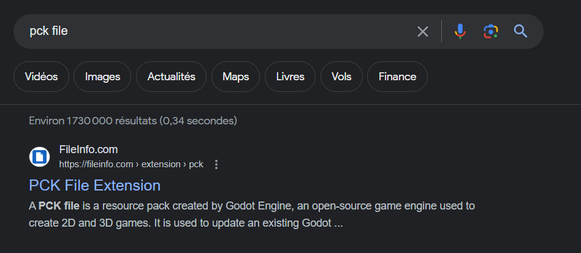

The provided file is a game. When running it, it seems pretty complicated to kill all ennemies. I first tried to decompile the game using some classical decompilers such as IDA or ghidra but the code was really unreadable. When dealing with exe file, it's good to pass it into a detector to grab some extra information about the programming language it was made from. I used this one : http://www.exeinfo.byethost18.com/


This does not give any worth information but when we click on the info viewer, we can see it's using the GoDot engine. 


This could have been also noticed by looking for the "pck" file extension on google



To deal with GoDot file, I used this decompiler : https://github.com/bruvzg/gdsdecomp. It outputted a lot of files : 


By scrolling a bit through the file, I ended up looking at the file Level_1.gd (in Script directory).

```gdscript
extends Node2D


var totalenemies = 0
var rng = RandomNumberGenerator.new()
var enemies_left = 0


func _process(delta):
	var mousepos = get_global_mouse_position()
	get_node("Crosshair").position = mousepos

	if enemies_left == 0:
		rng.seed = Vals.hits ^ enemies_left ^ Vals.playerdmg
		var fbytes = rng.randf()
		Vals.sd = fbytes
		get_tree().change_scene("res://Scenes/Level_2.tscn")

func _on_Enemy_killed():
	enemies_left -= 1

func _on_Enemy_alive():
	totalenemies += 1
	enemies_left += 1

func _ready():

	Input.set_mouse_mode(Input.MOUSE_MODE_HIDDEN)
```

We see that if there's no enemy left, we'll end up in the second scene, whose code is the following : 

```gdscript
extends Node2D

var totalenemies = 0
var rng = RandomNumberGenerator.new()
var enemies_left = 0


func _process(delta):
	var mousepos = get_global_mouse_position()
	get_node("Crosshair").position = mousepos

	if enemies_left == 0:
		rng.seed = int(Vals.sd)
		var fbytes = rng.randf()
		Vals.sd = fbytes
		fbytes = str(fbytes)
		var flg = fbytes.to_ascii().hex_encode()
		$CanvasLayer / Label.set_text("csawctf{" + flg + "}")

func _on_Enemy_killed():
	enemies_left -= 1

func _on_Enemy_alive():
	totalenemies += 1
	enemies_left += 1

func _ready():

	Input.set_mouse_mode(Input.MOUSE_MODE_HIDDEN)
```

We could think that we're stuck here as we don't know the seed. However, the method randf() returns 0 or 1 (https://docs.godotengine.org/en/stable/classes/class_randomnumbergenerator.html) as it's here converted to int ! To get the flag, one can used an online GoDot compiler (https://gdscript-online.github.io/) 

```gdscript
extends Node

var rng = RandomNumberGenerator.new()

func _ready():
	rng.seed = rng.randf()
	var fbytes = rng.randf()
	fbytes = str(fbytes)
	var flg = fbytes.to_ascii().hex_encode()
	print("csawctf{" + flg + "}")
	pass
```

Running this code in the compiler gives the flag ! 